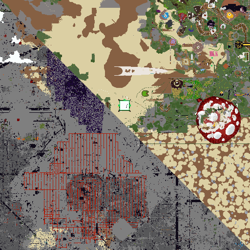

# XaerosMapFormat
A C++23 library for reading, writing, and rendering the Xaero's Map save format.

continuation and libraryfication of [XaerotoJourneyMap](https://github.com/DanDucky/XaerotoJourneyMap)



## Capabilities and Limitations

- Only parses the Xaero's World Map save files, and does not parse cache files. Caches are the only format written by Xaero's Map in singleplayer, so this is effectively only useful for server data.
- Can only write version `7.8` files, but can read any version's files. See [Versioning](#Versioning).
- Rendering is limited but working. It does not render lighting or overlays. This makes maps appear flat and often does not render water. This can be improved but is currently not a priority.
- Some maps save cave data, but this library does not read that data right now. It will only render the top layer of the region.
- Will correctly render biome tint.
- Outputs [stb_image_write](https://github.com/nothings/stb) compatible data.

## Building
```shell
cmake -S <path/to/source> -B <path/to/build/dir> -DJAVA_HOME="<path/to/java21/install>"
cmake --build <path/to/build/dir>
```

### Options
| Name                       | Description                                                               | Default Value |
|:---------------------------|:--------------------------------------------------------------------------|:--------------|
| `XAERO_BUILD_TESTS`        | Builds test executable                                                    | `ON`          |
| `XAERO_GENERATE_RESOURCES` | Generates Minecraft data lookup tables for rendering and format upgrades. | `ON`          |
| `XAERO_BUILD_EXAMPLES`     | Builds example programs                                                   | `ON`          |
| `XAERO_MINECRAFT_VERSION`  | Minecraft version for resources                                           | `latest`      |

## Dependencies

### Build Dependencies

- CMake
- C++23 compiler
- Catch2 (if `XAERO_BUILD_TESTS`)

> I'm sorry for these, but they are unfortunately necessary for this process unless we want to process textures in raw CMake. They can be turned off with `XAERO_GENERATE_RESOURCES` but this would just offload that work onto users, which would be a huge pain and provides ample room for mistakes. It might be possible to remove the Java dependency, but I don't know how to get the block ids from the version jar.

- Python (if `XAERO_GENERATE_RESOURCES`) *this has associated dependencies which are downloaded by pip in a .venv, so don't worry!*
- Java 21 (if `XAERO_GENERATE_RESOURCES`)

### Dependencies

All of these dependencies are managed and downloaded by CPM in the provided CMake file. However, they can be optionally provided at configure time.

- [libnbt++](https://github.com/PrismLauncher/libnbtplusplus)
- [ztd.text](https://github.com/soasis/text)
- [minizip-ng](https://github.com/zlib-ng/minizip-ng)
- [args](https://github.com/Taywee/args) (if `XAERO_BUILD_EXAMPLES`)
- [stb_image_write](https://github.com/nothings/stb) (if `XAERO_BUILD_EXAMPLES`)

## Versioning

tldr: Xaero's Map format version `7.8`

This is a little bit difficult because the versioning is dependent on an internal Xaero's Map format version number. 
Currently, this supports reading from all versions up to 7.8 and writes version 7.8 files.
Also the minor version number appears to actually mean legacy version number, with new versions only updating the major version.